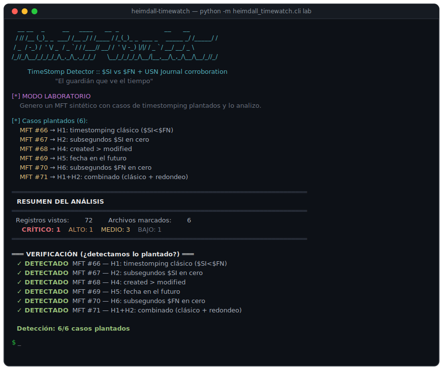

# 🛡️ heimdall-timewatch

> **TimeStomp Detector** — Detección de manipulación de timestamps en NTFS mediante comparación `$STANDARD_INFORMATION` vs `$FILE_NAME` y corroboración cruzada con el USN Journal.
>
> *"El guardián que ve el tiempo."*

Creado por **Yoandy Ramirez Delgado** · Herramienta de DFIR / Blue Team para uso educativo y autorizado.

<p>
  <a href="https://github.com/heindall92/heimdall-timewatch_DFIR/releases"></a>
  
  
  
  
  
  
</p>

<p align="center">
  
</p>

---

## ¿Qué hace?

`heimdall-timewatch` detecta **timestomping** — la técnica anti-forense con la que un atacante modifica las marcas de tiempo de un archivo para esconderlo de los análisis de línea temporal. Es una de las técnicas de evasión más usadas por actores de amenazas, mapeada en MITRE ATT&CK como **T1070.006 (Indicator Removal: Timestomp)**.

La herramienta parsea el Master File Table (MFT) de NTFS a bajo nivel, extrae los 8 timestamps MACE de cada archivo (4 del atributo `$SI`, modificable en user-mode, y 4 del `$FN`, que solo escribe el kernel) y aplica **6 heurísticas independientes** más una **corroboración con el USN Journal** para identificar archivos con marcas de tiempo manipuladas.

## Filosofía

**Honestidad forense ante todo.** Ningún indicador que esta herramienta reporta es prueba concluyente por sí solo. Cada hallazgo incluye su nivel de confianza y sus falsos positivos conocidos. Un detector que exagera su certeza es peor que ninguno. La corroboración entre múltiples artefactos siempre prevalece sobre una sola señal.

**Motor sin dependencias externas.** El núcleo forense (`heimdall_timewatch/`) usa **solo biblioteca estándar** de Python 3.8+. Debe ser auditable, portable y ejecutable en un entorno aislado sin `pip install`.

**GUI opcional, deps separadas.** El panel de escritorio (`gui/`) añade PySide6, keyring y PyInstaller — justificado para una interfaz real, pero **no forman parte del motor**. Puedes usar CLI + motor en air-gap; la GUI es un extra.

| Componente | Dependencias | Instalación |
|------------|--------------|-------------|
| **Motor + CLI** | Ninguna (stdlib) | `pip install -e .` o ejecutar directo |
| **GUI (opcional)** | PySide6, keyring | `pip install -r requirements-gui.txt` |
| **Tests (dev)** | pytest | `pip install -r requirements-dev.txt` |

## Instalación

### Motor y CLI (recomendado para DFIR / air-gap)

```bash
git clone https://github.com/heindall92/heimdall-timewatch_DFIR.git
cd heimdall-timewatch_DFIR
# Sin pip install también funciona:
python3 -m heimdall_timewatch.cli lab
# Opcionalmente, instalar entry point:
pip install -e .
```

### GUI de escritorio (opcional)

```bash
pip install -r requirements-gui.txt
python run_gui.bat          # Windows
# o: python -m gui.main
```

> **Requisitos:** Python 3.8 o superior. El motor no necesita nada más. Funciona en Windows y Linux
> (la salida con color y caracteres Unicode está forzada a UTF-8, así que no se
> rompe en la consola de Windows).

## Uso rápido

### Modo laboratorio (pruébalo ya, sin MFT real)

```bash
python3 -m heimdall_timewatch.cli lab
```

Genera un MFT sintético con 6 casos de timestomping plantados y verifica que el detector los encuentra. Es tu "campo de tiro" para estudiar la técnica.

### Analizar un MFT real

```bash
# Extrae el $MFT primero con FTK Imager, MFTECmd, o:
#   icat -o <offset> imagen.dd 0 > \$MFT

python3 -m heimdall_timewatch.cli scan -m \$MFT

# Con corroboración USN Journal (recomendado):
python3 -m heimdall_timewatch.cli scan -m \$MFT --usn \$J --html informe.html

# Con fecha de instalación del SO (mejora la heurística H5):
python3 -m heimdall_timewatch.cli scan -m \$MFT --system-install 2024-01-15

# Exportar a varios formatos:
python3 -m heimdall_timewatch.cli scan -m \$MFT --json out.json --csv out.csv --html out.html
```

### Volcar timestamps a CSV (sin juzgar)

```bash
python3 -m heimdall_timewatch.cli parse -m \$MFT -o timestamps.csv
```

## Las heurísticas

| Código | Detecta | Confianza |
|--------|---------|-----------|
| **H1** | `$SI` anterior a `$FN` (retroceso temporal) | Media → Alta si el desfase supera 30 días |
| **H2** | Subsegundos de `$SI` en `.0000000` (herramienta automática) | Baja |
| **H3** | RID alto con fecha de creación anómalamente antigua | Baja |
| **H4** | `created` posterior a `modified` (imposible lógico) | Media |
| **H5** | Timestamp en el futuro o anterior a la instalación del SO | Media |
| **H6** | Subsegundos de `$FN` en cero (manipulación avanzada de `$FN`) | Media |
| **USN** | El USN Journal contradice la fecha de creación `$SI` | **Alta** |

## Cómo extraer los artefactos de un sistema

```bash
# Con FTK Imager (GUI): Add Evidence Item → Logical Drive → exportar
#   $MFT y $Extend\$UsnJrnl:$J desde la raíz del volumen.

# Con MFTECmd (Eric Zimmerman):
MFTECmd.exe -f C:\$MFT --csv salida

# Desde Linux sobre una imagen montada:
icat -o 2048 disco.dd 0 > \$MFT
```

## Limitaciones honestas

- **El método `$SI` vs `$FN` tiene puntos ciegos.** Si el atacante renombra o mueve el archivo en el mismo volumen después de timestompear, Windows copia el `$SI` manipulado al `$FN` y H1 deja de dispararse. Por eso la corroboración con USN es clave.
- **El USN Journal es circular.** Si el evento de creación ya rotó fuera del journal, no habrá corroboración. Ausencia de evidencia no es evidencia de ausencia.
- **Falsos positivos legítimos:** instaladores que tocan `$SI`, archivos extraídos de ZIP (subsegundos truncados), copias que preservan mtime, relojes mal configurados. Cada hallazgo los documenta.

## Estructura

```
heimdall-timewatch/
├── heimdall_timewatch/    # motor forense (stdlib only)
│   ├── mft_parser.py      # parser de bajo nivel del MFT
│   ├── detector.py        # motor de las 6 heurísticas
│   ├── usn_journal.py     # parser USN + corroboración
│   ├── scan_service.py    # orquestación compartida CLI + GUI
│   ├── labgen.py          # generador de MFT de laboratorio
│   └── cli.py             # interfaz de línea de comandos
├── gui/                   # panel opcional (PySide6)
├── tests/                 # pytest — lab 6/6 + parser
├── requirements.txt       # motor: sin deps (documentación)
├── requirements-gui.txt   # GUI opcional
├── requirements-dev.txt   # pytest para CI
└── setup.py
```

## Tests

```bash
pip install -r requirements-dev.txt
pytest -q
```

Incluye verificación automática del modo laboratorio (6/6 casos plantados) y round-trips del parser MFT (fixup, FILETIME, atributos `$SI`/`$FN`).

## Aviso legal

Para uso en sistemas propios, laboratorios autorizados (HTB, THM, máquinas de práctica) o auditorías DFIR con autorización explícita. El análisis forense de sistemas ajenos sin autorización puede ser ilegal. Esta herramienta existe para **detectar** la actividad anti-forense, no para realizarla.

## Licencia

Distribuido bajo licencia **MIT** (ver [LICENSE](LICENSE)). Eres libre de usar, modificar y redistribuir la herramienta conservando el aviso de copyright.

La GUI opcional empaqueta Qt vía PySide6 (LGPL v3) y otros componentes de terceros; sus obligaciones de licencia se detallan en [THIRD_PARTY_LICENSES.md](THIRD_PARTY_LICENSES.md) y aplican únicamente al distribuir la GUI o el ejecutable. El motor y la CLI son solo stdlib, sin terceros.

## Contribuir

Las contribuciones son bienvenidas: nuevas heurísticas, parsers de artefactos adicionales (LNK, Prefetch, $LogFile), o casos de laboratorio. Abre un *issue* para discutir cambios grandes antes de un *pull request*. Mantén el **motor sin dependencias externas** (stdlib) y documenta los falsos positivos de cada heurística nueva. Añade tests en `tests/` para cualquier cambio en parser o heurísticas.

---

*heimdall-timewatch · creado por Yoandy Ramirez Delgado · 2026 · MIT License*
